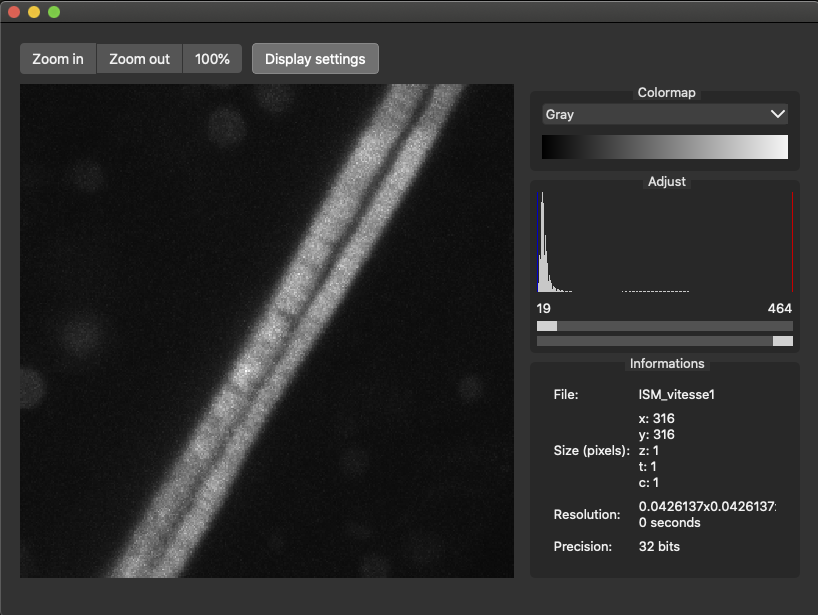

# SImageViewer

5D image viewer implemented using Qt Gui


# Compile

First you need to install the dependencies: 
- qt6
- score (from slib)
- simage  (from slib)
- simageio (from slib)
- sdata (from slib)

Configre with cmake:
```
mkdir build
cd build
ccmake ..
```

Fill the dependencies directories where you installed the slib dependencies. And run configure

Compile:
```
make
```

To run you need to copy the theme directory in the bin directory
```
cp -r ../tools/theme/ ./bin/
```

you can then run the demo:
```
./bin/demo
```




  